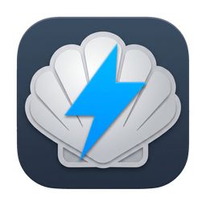
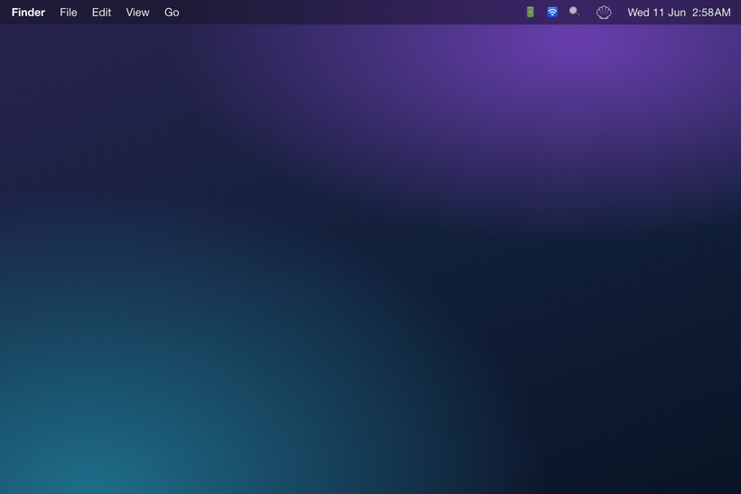
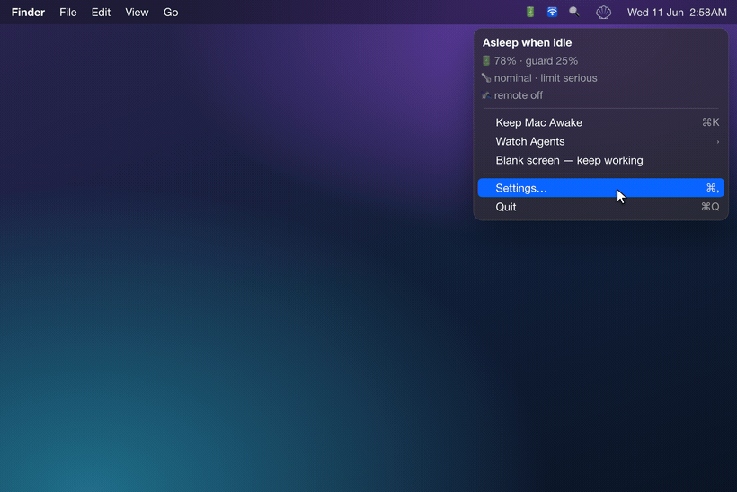
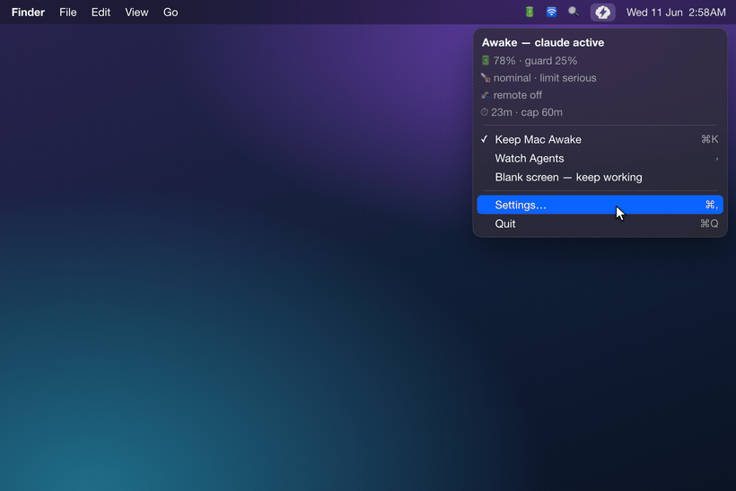

<div align="center">



# Electronic Clam

**Agents must keep working — your Mac shouldn't cook trying.**
Detecta el *trabajo*, no solo un proceso en ejecución.

[](https://www.apple.com/macos/)
[](https://swift.org)
[](LICENSE)
[](CHANGELOG.md)

<!-- i18n-langbar -->
[English](README.md) · [한국어](README.ko.md) · [中文](README.zh-CN.md) · [日本語](README.ja.md) · **Español**



</div>

---

## Lo más destacado

- **Despierto con la tapa cerrada.** Un interruptor evita que tu Mac duerma incluso con la tapa cerrada — sin comandos de terminal ni contraseña en cada cambio.
- **Detecta el trabajo, no los procesos.** Permanece despierto solo mientras un agente de programación *produce salida de verdad*; cuando el agente se detiene, tu Mac puede volver a dormir.
- **5 agentes listos para usar** — Claude Code, Codex, Cursor, opencode, Antigravity — y puedes añadir los que quieras.
- **Protecciones que se adaptan.** Duerme automáticamente cuando la batería o la temperatura cruzan un límite peligroso.
- **Consciente de la actividad remota.** No duerme mientras lo usas por SSH, compartir pantalla o Tailscale — y mantiene vivas las compilaciones remotas.
- **Nunca lee tus conversaciones ni tu código.** La detección de agentes solo mira las marcas de tiempo del transcript, nunca su contenido.

---

## Funciones

El objetivo es que tu agente siga trabajando — de forma **segura** — sin interrupciones. Todo lo de abajo está al servicio de eso.

### Mantener despierto según el agente



Es simple: deja que tu agente siga trabajando sin interrupciones.

Por eso el interruptor sigue si el agente *está trabajando ahora mismo*, no si existe un proceso. Mientras trabaja, el Mac permanece despierto; cuando se detiene, se libera (modo **Strict**). También hay un modo **Lax** que simplemente mantiene despierto mientras el proceso esté vivo.

**Detectados por defecto (5):** Claude Code · Codex · Cursor · opencode · Antigravity.

**Activar en Customize (desactivado por defecto):** Aider · Cline · Roo Code · OpenHands · Hermes · Openclaw.

También puedes añadir agentes que no estén aquí — da un patrón glob o deja un único archivo de declaración en `~/.config/eclam/traces.d/*.json`.

Por defecto, los agentes se detectan sondeando sus registros de sesión (~5 s, ~30 s con la pantalla bloqueada), así que un agente recién iniciado puede tardar unos segundos en aparecer. Claude, Codex y Hermes se detectan al instante si instalas sus hooks (opcionales).

### Protecciones de seguridad



Ejecutar una carga pesada en modo clamshell dentro de una mochila es un riesgo térmico. Electronic Clam vigila la temperatura y la batería, y deja dormir el Mac cuando la cosa se pone peligrosa:

- **Batería** — el umbral depende de tu configuración: 30 % con la tapa cerrada y sin pantalla externa, 10 % en los demás casos (ajustable). Una conexión de corriente débil o inestable cuenta como batería.
- **Térmico** — combina la señal de macOS con otra interna más sensible para reaccionar antes.
- **Duración máxima** — el modo Desktop (corriente + tapa abierta + pantalla externa) se salta el tope por completo.
- **Modo de Bajo Consumo** — aprieta ambos un paso (+10 puntos de batería, un nivel térmico).

Con la corriente desconectada y la tapa cerrada en una mochila, juzga con más cautela y se libera solo cuando todo vuelve a ser seguro. Puedes optar por recibir una notificación cuando ponga el Mac a dormir.

### Detección de actividad remota


Electronic Clam no duerme mientras usas el Mac en remoto. Detecta SSH, compartir pantalla, Tailscale y apps de control remoto conocidas. Por defecto es simple: permanece despierto mientras estés conectado.

### Notificaciones de Telegram (desactivadas por defecto)

Conecta tu propio bot de Telegram y recibirás un aviso cuando un agente se detenga o tu Mac se duerma — con el % de batería, la temperatura y el nombre del host.

### Otros

- **CLI + sesiones con nombre** — manéjalo directamente desde la terminal (ver [Usage](#usage)).
- **Hooks de agente opcionales** — al instalarlos se inyecta un hook de señal de actividad en la configuración de Claude / Codex / Hermes; al desinstalarlos se restauran.
- **Restauración del sueño garantizada al salir** — tres capas: restauración síncrona al salir, un manejador de SIGTERM y un watchdog de 20 segundos por si la app se cuelga.
- **Abrir al iniciar sesión (opcional)** — inicia Electronic Clam automáticamente cuando inicias sesión; desactivado por defecto.
- **Notificaciones de actualización** — consulta GitHub en busca de nuevas versiones y te indica la descarga; solo avisa, nunca instala nada por su cuenta.
- **Protección contra el bloqueo por VPN en modo clamshell (opcional, desactivada por defecto).** Sin pantalla externa y con batería, cerrar la tapa *bloquea* la pantalla, y ese bloqueo desconecta una VPN SSL de FortiClient (que exige volver a iniciar sesión para reconectar). Una pantalla virtual invisible ancla la sesión para que la pantalla no se bloquee y el túnel sobreviva — sin retroiluminación, apenas consume energía y no necesita hardware ni corriente extra. La acción **Apagar pantalla** también se divide en **Atenuar (Dim)** (oscura pero sin bloquear · segura para la VPN · por defecto) y **Dormir (Sleep)**, con una notificación opcional si la VPN se desconecta.
- **Configuración del helper más resistente** — no registra el helper en segundo plano desde una descarga en cuarentena ni desde una ubicación temporal (translocada) que macOS bloquea; en su lugar te guía para mover la app a Aplicaciones. Ajustes señala copias duplicadas y versiones que no coinciden, y `eclam repair` recupera un helper atascado o inalcanzable.

## Instalación

```bash
brew install --cask jadhvank/tap/eclam
open /Applications/ElectronicClam.app
```

Activa **Electronic Clam Helper** en **System Settings → General → Login Items & Extensions**.

## Usage

**Haz clic izquierdo** en el icono de la barra de menús para alternar el modo despierto. **Haz clic derecho** para abrir el menú completo.

El icono es una almeja con tres estados: concha en contorno (durmiendo), concha rellena + rayo (lo mantienes despierto tú) y concha rellena + marca remota (un agente, una sesión remota o una protección lo mantiene despierto automáticamente).

### Menú

| Elemento | Acción |
|---|---|
| Encabezado de estado | El estado actual de un vistazo (p. ej. «Dormir al estar inactivo», «Despierto — hasta que salga», «Despierto — sesión remota») |
| **Mantener el Mac despierto** (⌘K) | Alternar el modo despierto |
| **Vigilar agentes** ▸ | Activar/desactivar los agentes a detectar (muestra « • activo» cuando lo está); **Personalizar…** al final |
| **Apagar pantalla — seguir trabajando** | Apaga las pantallas pero mantiene el Mac y los agentes en marcha |
| **Ajustes…** (⌘,) | Abrir ajustes |
| **Salir** (⌘Q) | Salir (restaura el sueño antes) |

### CLI

El cask de Homebrew crea un enlace simbólico `$HOMEBREW_PREFIX/bin/eclam`.

```
eclam on [--for <dur>] [--forever]   # keep awake; default 2h, then the helper auto-releases (no GUI needed, survives reboot)
eclam off
eclam status [--json]
eclam keep --while <pid>
eclam watch <agent> [--grace s] [--check-interval s] [--max min] [--json]
eclam session start <name> [--message <text>] / stop <name> / list [--json]
eclam debug [agents] [--json]
eclam help
```

**Códigos de salida:** `0` éxito · `1` argumentos incorrectos · `2` helper inalcanzable · `3` se requiere aprobación · `4` cancelado por el usuario.

## Seguridad y privacidad

- Lee los relojes de los archivos, no su contenido.
- Sin telemetría, sin seguimiento, sin analíticas.
- Se exige la verificación del llamante XPC.
- Firmado con Developer ID + notarizado por Apple.
- Los tokens se quedan en local.
- El sueño siempre se restaura al salir o al fallar.
- Una sola vía de permisos (`SMAppService`).

Consulta [Seguridad y privacidad](docs/security.md) para más detalles.

## Advertencias / Limitaciones conocidas

- **La detección puede tardar unos segundos sin un hook.** Los agentes sin un hook instalado se detectan sondeando sus registros de sesión (~5 s, ~30 s con la pantalla bloqueada). Claude / Codex / Hermes son instantáneos en cuanto instalas sus hooks.
- **Sin protecciones de seguridad usando solo la CLI.**
- **Agentes integrados en VS Code** (Cline / Roo Code) no tienen un proceso independiente, así que la detección en modo Lax es limitada.
- **Solo Apple Silicon**, macOS 13+ (Ventura).

## Tecnologías

- **Lenguaje / UI:** Swift + AppKit (`NSStatusItem`, app de barra de menús `LSUIElement` — sin Dock).
- **Control de energía:** IOKit SPI — `IOPMSetSystemPowerSetting("SleepDisabled")` mediante un binding `@_silgen_name`.
- **Separación de privilegios:** un daemon `SMAppService` que habla con la app por `NSXPCConnection` (mach service).
- **Compilación:** `swiftc` directo (sin SwiftPM), **sin dependencias externas**.
- **Objetivos:** arm64, macOS 13+ (Ventura).

## Build from source

```bash
./scripts/build.sh            # app + helper + hook binaries (Developer ID signed)
open build/ElectronicClam.app
```

- Invocación directa de `swiftc`, objetivo `arm64-apple-macos13.0`. Usa `ECLAM_SIGN_ID=-` para compilaciones locales ad-hoc rápidas.
- Estructura del bundle: `Contents/MacOS/{ElectronicClam, ElectronicClamHelper, eclam-hook}` + `Contents/Library/LaunchDaemons/com.jadhvank.eclam.helper.plist`.
- Las compilaciones de lanzamiento se firman con Developer ID y se notarizan (con staple por `release.sh`).

## Apóyanos

Electronic Clam es gratis y de código abierto. Él mantiene despierto a tu agente; tu café mantiene despierto al desarrollador. ☕

[](https://ko-fi.com/jadhvank)

## Licencia

[MIT](LICENSE).

---

<sub>`README.zh-CN.md`, `README.ja.md` y `README.es.md` se generan a partir de este archivo con el comando `/translate` — no los edites a mano. `README.ko.md` se mantiene a mano.</sub>
